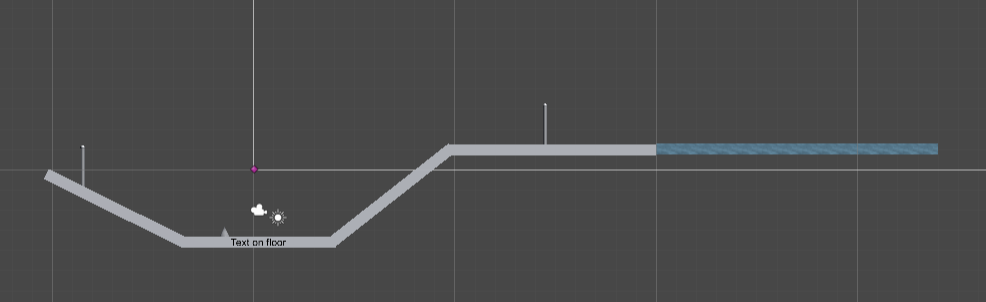
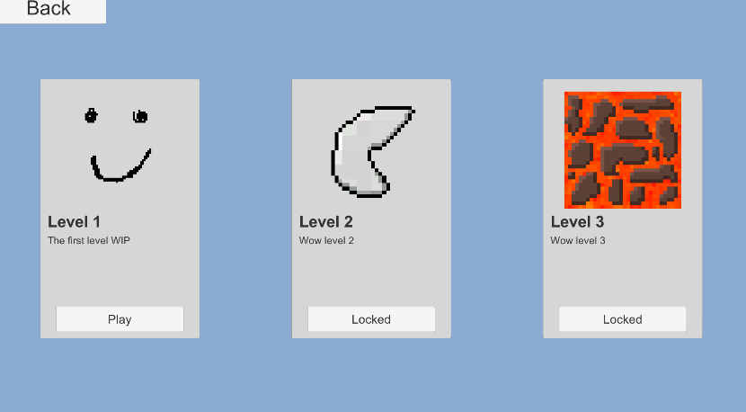
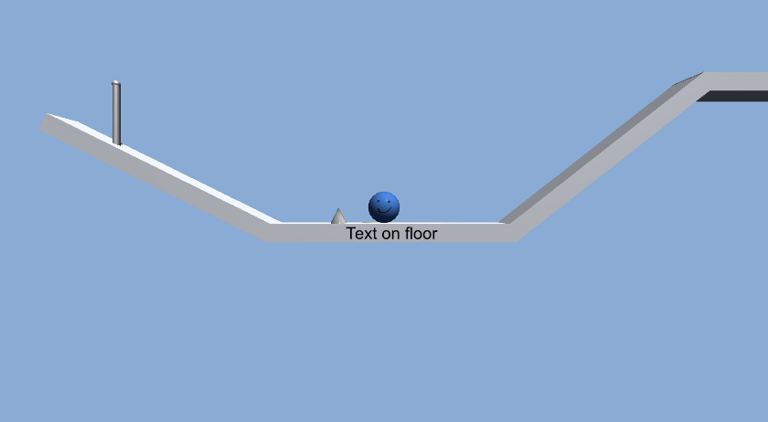
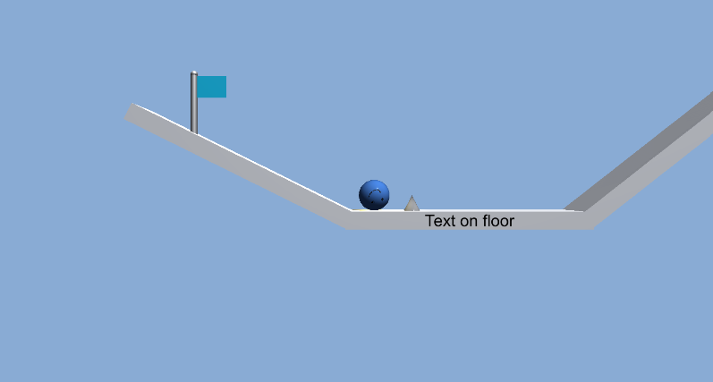
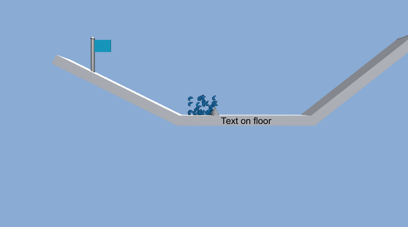
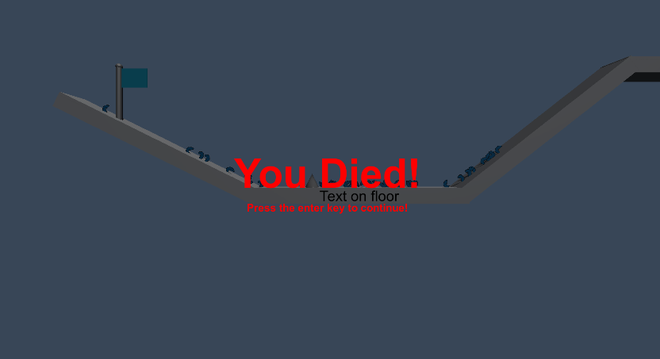

# 2D Ball
###### Also known as 2D cube
 

### Scene

### Game

###### I wanted to make a pseudo 3D game where you roll around
###### (When the player touches a spike they bounce the first time and explode/die the second time)
###### I didn't come much further than this...
